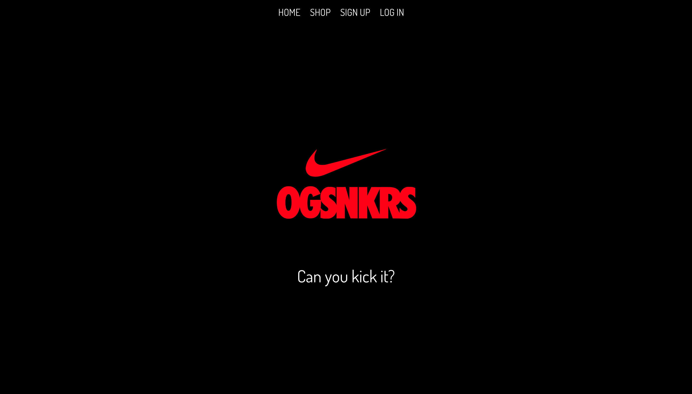
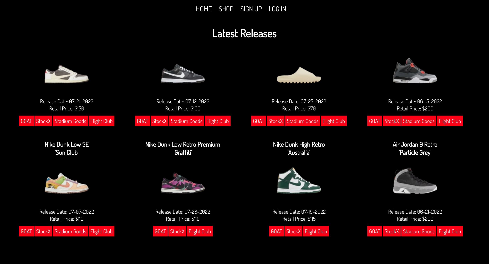

# OG-SNKRS

## Description

This interactive SPA MERN stack web application utilizes HTML, CSS, JavaScript, MongoDB, Express, React, Node, GraphQL and Node Package Manager to build a responsive sneaker platform where sneakerheads and shoe enthusiasts have the ability to view latest releases, compare prices, and choose the best resale site option to purchase from. 

Future updates will include allowing users to:
- Search for and filter through specific sneakers based on brand, name, and/or retail price ranges
- Sign up, login, and save their favorite sneakers to their OG-SNKRS wish list

> Visit the deployed OG-SNKRS site [HERE](https://og-snkrs.herokuapp.com/)

## Table of Contents
  - [Preview](#preview)
  - [License](#license)
  - [Contribution](#contribution)
  - [Questions](#questions)
  - [Credits](#credits)

## Preview

## License
- This project is licensed under: [MIT](https://opensource.org/licenses/MIT)

## Contribution 
- Forking this repository is always welcomed and encouraged!

> If you encounter a problem with this application, please add an issue or pull request to the GitHub repository. 

## Questions
- Please feel free to use this application at any time and visit our personal GitHub profiles to access other open source projects! 

## Credits

- Amir Hackett, 07/2022 | [GitHub](https://github.com/Amir-Hackett) | [Portfolio](https://amir-hackett.github.io/react-portfolio/) | [LinkedIn](https://www.linkedin.com/in/amir-hackett/) 

- Denysha Guerrios-Armaiz, 07/2022 | [GitHub](https://github.com/denysha-abigail) | [Portfolio](https://denysha-abigail.github.io/denysha-abigail-io/) | [LinkedIn](https://www.linkedin.com/in/denysha-guerrios-armaiz-ab2750229/)

- Thuy Nguyen, 07/2022 | [GitHub](https://github.com/ThuyTTTN) | [Portfolio](https://thuytttn.github.io/react-portfolio/) | [LinkedIn](https://www.linkedin.com/in/thuy-nguyen-a2333031/)

- Khai Truong, 07/2022 | [GitHub](https://github.com/teatyped) | [Portfolio](https://teatyped.github.io/Portfolio/) | [LinkedIn](https://www.linkedin.com/in/khai-truong-7491a7230/)